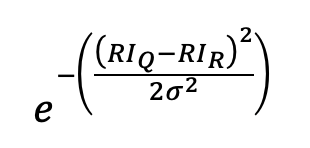
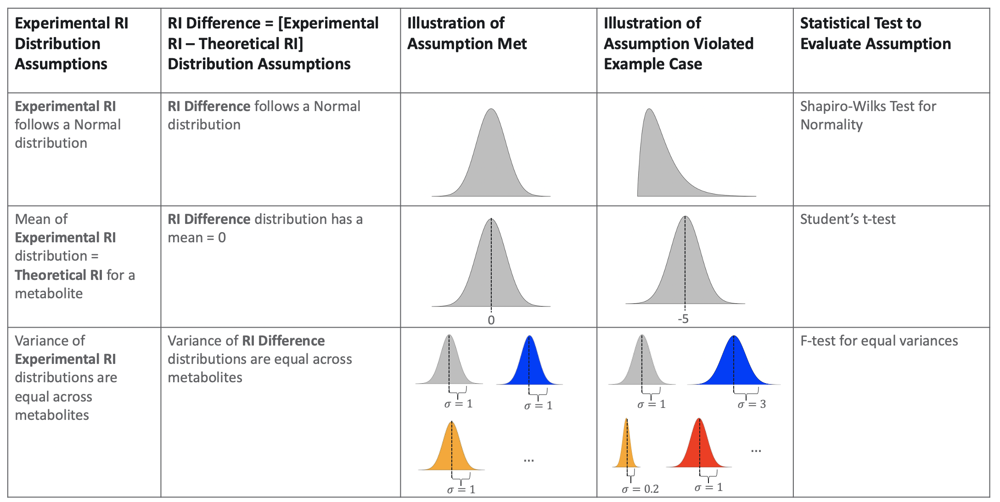

```{r Setup, include=FALSE}
path <- "~/Desktop/Git_Repos/metabolomics_scoring_metrics/Retention_Index/Markdowns/2-Retention-Index-Assumption-Violations/"
knitr::opts_chunk$set(echo = FALSE, warning = FALSE, message = FALSE)
knitr::opts_knit$set(rootdir = path)
#setwd(path)
library(plotly); library(ggplot2); library(ggpubr); library(knitr); library(DT); 
library(trelliscopejs); library(gapminder); library(dplyr); 
library(tidyr); library(purrr); library(e1071); library(Hmisc); library(ggpubr);
library(data.table); library(grDevices); library(patchwork); library(lubridate);
library(patchwork); library(cowplot)
```

```{r Data Load}
# Read in the verified and cleaned annotation data
CoreMS_Files <- list.files("../../../Data/CoreMS_Identification/", full.names = T)

# Pull all true positives 
Annotations <- fread("~/Downloads/AnnoTP.txt")

# Calculate RID
Annotations$`Retention Index Difference` <- Annotations$`Retention Index` - Annotations$`Retention Index Ref`

# Subset to N > 30
MetaboliteCount <- table(Annotations$`Compound Name`, dnn = c("Compound.Name")) %>%
  data.frame() 
Anno30 <- Annotations[Annotations$`Compound Name` %in% 
                      MetaboliteCount[MetaboliteCount$Freq >= 30, "Compound.Name"],]
```

# Testing Data Assumptions

\(RI_{i} \sim  N(\mu_{i}, \sigma_{i})\)

The score is the normal distribution kernel:

```{r Equation}

```

```{r Assumption, echo = F}

```

**Figure 1: Assumptions of the Fiehn retention index score.**

1. Experimental RI follows a normal distribution

2. Experimental RI \(\bar{x}\) equals Theoretical RI \(\mu\)

3. Experimental RI \(s\) are equal 

4. An implied data assumption is that \(\mu\) is independent of \(\sigma\). This is useful to know for when we select machine learning models.  

5. Experimental RI \(s\) depends on metabolite mass

## RI: Normal Distribution

```{r Assumption_NormalDistribution, echo = F}
# Preform a shapiro wilks test and student's t-test
Anno30_StatsTest <- Anno30 %>%
  select(`Compound Name`, `Retention Index Difference`) %>%
  group_by(`Compound Name`) %>%
  nest() %>%
  rename(Nest = data) %>%
  mutate("Shapiro" = shapiro.test(Nest %>% unlist())$p.value,
         "TTest" = t.test(Nest %>% unlist())$p.value, 
         "SD" = sd(Nest %>% unlist()),
         "Mean" = mean(Nest %>% unlist()),
         "Count" = length(Nest %>% unlist()))

# Display results in a summary table
data.frame(
  "Number of Metabolites" = nrow(Anno30_StatsTest),
  "Fails Shapiro Test" = nrow(Anno30_StatsTest[Anno30_StatsTest$Shapiro <= 0.05,]),
  "Passes Shapiro Test" = nrow(Anno30_StatsTest[Anno30_StatsTest$Shapiro > 0.05,])
) %>% kable()

# Plot a high and low example
HighShapiro <- Anno30_StatsTest[which.max(Anno30_StatsTest$Shapiro), "Nest"][[1]][[1]]
HighShapiroName <- Anno30_StatsTest[which.max(Anno30_StatsTest$Shapiro), "Compound Name"][[1]]
LowShapiro <- Anno30_StatsTest[which.min(Anno30_StatsTest$Shapiro), "Nest"][[1]][[1]]
LowShapiroName <- Anno30_StatsTest[which.min(Anno30_StatsTest$Shapiro), "Compound Name"][[1]]

# Boxplot function
statsBoxplot <- function(Dataset, Title) {
  ggplot(Dataset, aes(y = `Retention Index Difference`)) + geom_boxplot() + theme_bw() +
    ggtitle(Title) + ylim(c(-20,20)) + theme(plot.title = element_text(size = 8), 
     axis.ticks.x = element_blank(), axis.text.x = element_blank())
}

# Plot boxplots
statsBoxplot(HighShapiro, paste("Passes Shapiro:", HighShapiroName, ", n = 34"))  +
statsBoxplot(LowShapiro, paste("Fails Shapiro:", LowShapiroName, ", n = 299"))
```

**Figure 2: An example of a metabolite that passes (right) and fails (left) the Shapiro-Wilk's test for normality.**

**Goal:** To determine how many of the 87 metabolites with an n >= 30 
follow a normal distribution, we ran a Shapiro-Wilks test for normality with an 
\(\alpha\) level of 0.05. The null hypothesis \(N_{0}\) is that the distribution is normal.

**Notes:** A majority of metabolites fail the test for normality; therefore, we 
reject the null that retention index follows a normal distribution. 

## RI: Experimental \(\bar{x}\) = 0

```{r Assumptions_MeanIs0, echo = F}
# Make a histogram of RID means
ggplot(data = Anno30_StatsTest, aes(x = Mean)) +
  geom_histogram(color = "black", fill = "lightblue", binwidth = 2.5) + 
  theme_bw() + ylab("Frequency") + xlab("Retention Index Difference Mean") +    
  theme(plot.title = element_text(hjust = 0.5)) + 
  ggtitle("RID Mean per Metabolite, bin size is 2.5") +
  stat_bin(aes(y = ..count.., label = ifelse(..count.. > 0, ..count.., "")), 
    binwidth = 2.5, geom = "text", vjust = -0.25)


# Display results in a summary table
data.frame(
  "Number of Metabolites" = nrow(Anno30_StatsTest),
  "Fails T Test" = nrow(Anno30_StatsTest[Anno30_StatsTest$TTest <= 0.05,]),
  "Passes T Test" = nrow(Anno30_StatsTest[Anno30_StatsTest$TTest > 0.05,])
) %>% kable()
```

**Figure 3: The distribution of retention index difference means, which should be close to 0.**

**Goal:** To determine how many of the 87 metabolites with an n >= 30 
have a true \(\mu\) of 0, we ran one sample t-test with an \(\alpha\) level of 0.05. 
The null hypothesis \(N_{0}\) is that \(\mu\) is 0.

**Notes:** All metabolites fail the Student's T-Test; therefore, we 
reject the null that the true retention index mean is 0. 

## RI: \(s\) are equal

```{r Assumption_AllSDAreEqual, echo = F}
ggplot(data = Anno30_StatsTest, aes(x = SD)) +
  geom_histogram(color = "black", fill = "#80CEE1", binwidth = 0.5) + theme_bw() + ylab("Frequency") + 
  xlab("Retention Index Difference Standard Deviation") + 
  theme(plot.title = element_text(hjust = 0.5)) + 
  ggtitle("Retention index difference standard deviation per metabolite") +
  stat_bin(aes(y = ..count.., label = ..count..), binwidth = 0.5, geom = "text", 
    vjust = -0.25)
```

**Figure 4: The distribution of retention index standard deviations, which should be close to 3.**

**Goal:** To test whether the variance of the retention index difference per metabolite
is consistent. We would expect a histogram to show similar standard deviation values. 

**Notes:** The standard deviation ranges from `r min(Anno30_StatsTest$SD)` to `r max(Anno30_StatsTest$SD)`
and the variance from `r min(Anno30_StatsTest$SD)^2` to `r max(Anno30_StatsTest$SD)^2`. An F-test
for equal variance test between two metabolites. An F-test between the highest and 
lowest \(\sigma^2\) is less than 0.01. We can reject the null that the variances 
are equal across all metabolite retention index differences. 

## RI: \(\mu\) independent of \(\sigma\)

```{r Assumptions_MeanIndependentSD, echo = F, error = F, warning = F, message = F}
cor.test(x = abs(Anno30_StatsTest$Mean), y = Anno30_StatsTest$SD, method = "spearman")

plot_ly(Anno30_StatsTest, x = abs(Anno30_StatsTest$Mean), y = Anno30_StatsTest$SD, 
  hoverinfo = "text", type = "scatter", mode = "markers", 
  hovertext = paste("Mean:", round(Anno30_StatsTest$Mean, 4), "<br>SD:", 
  round(Anno30_StatsTest$SD, 4), "<br>Metabolite:", 
  Anno30_StatsTest$Compound.Name, "<br>N:", Anno30_StatsTest$Count)) %>%
layout(xaxis = list(title = "Absolute Value of the Mean"), yaxis = list(title = "Standard Deviation"),
  title = paste("Retention Index Difference, n = 87"), showlegend = F)
```

**Figure 5: The relationship between the standard deviation and the mean of each metabolite's retention index distribution.**

We can reject the assumption that \(\mu\) is independent of \(\sigma\).

**Goal:** The fourth data assumption is that the standard deviation \(\sigma\) is independent
from the mean \(\mu\) for the retention index difference per metabolite. An easy way to 
determine wheter there is a relationship between \(\mu\) and \(\sigma\) is to test
their relationship with a non parametric correlation test.

**Notes:** There is likely a relationship between \(\mu\) and \(\sigma\). 

## Conclusion

```{r StatsSummary, echo = F}
data.table::data.table(
  Assumption = c("RID is Normal", "RID mean is 0", "RID SD are equal", 
                 "RID mean is independent of SD"),
  `Pass/Fail` = rep("Fail", 4)
) %>% kable()
```

# Effect of Violating Assumptions

## No Violations

```{r No Violations}
# Set the random seed for consistent results 
set.seed(630)

# Define a function to calculate RI score
RIscore <- function(RI_d, sigma = 3) {
  exp(-1 * (RI_d^2/(2 * sigma^2)))
}

# Define a function to plot RI_Scores 
RIplot <- function(vec, title) {
  df <- data.frame(vec)
  ggplot(df, aes(y = vec)) + geom_boxplot() + theme_bw() + 
    ylim(c(0,1)) + ylab("RI Score") + xlab("") + ggtitle(title) +
    theme(plot.title = element_text(hjust = 0.5), axis.line.x = element_blank(),
          axis.ticks.x = element_blank(), axis.text.x = element_blank())  
}

# Simulate retention index difference from a distribution with no violations
RID_noviol <- rnorm(1000, 0, 3) %>% lapply(RIscore) %>% unlist() 
no_viol <- RIplot(RID_noviol, "No Violations")
no_viol + ggtitle("") + xlab("No Violations")
```

**Figure 6: The distribution of RI scores when no assumptions of the score is violated. 1000 draws were taken from a normal distribution with a mean of 0, a sd of 3, and a skew of 0 (all normal distributions are assumed to have no skew).**

Above are the results of calculating the retention index score of the expected 
distribution where no violations are made (**Fig. 6**). It's worth noting that 
the median score `r median(RID_noviol)` is not particularly high, and between 
0-1 there are no outliers. Next, we will test how the score changes when the mean
assumption is violated. 

## Mean Violation

```{r Mean Violation}
RID_meanviol <- do.call(rbind, lapply(seq(-35,35,5), function(mu_d) {
  Res <- data.table("Mean" = mu_d, "Values" = rnorm(1000, mu_d, 3))
  Res$`RI Score` <- RIscore(Res$Values)
  return(Res)
}))
RID_meanviol$Mean <- factor(RID_meanviol$Mean, levels = as.character(seq(-35,35,5)))

RID_meanviol_10 <- do.call(rbind, lapply(seq(-10,10,1), function(mu_d) {
  Res <- data.table("Mean" = mu_d, "Values" = rnorm(1000, mu_d, 3))
  Res$`RI Score` <- RIscore(Res$Values)
  return(Res)
}))
RID_meanviol_10$Mean <- factor(RID_meanviol_10$Mean, levels = as.character(seq(-10,10,1)))

mean_viol <- (ggplot(RID_meanviol_10, aes(x = Mean, y = `RI Score`)) + geom_boxplot() +
  theme_bw() + theme(legend.position = "none")+
  theme(plot.title = element_text(hjust = 0.5)) + xlab(expression(mu)) + ggtitle("") +
  xlab("") + geom_vline(xintercept = which(levels(factor(RID_meanviol_10$Mean)) == "0"), color = "red"))

# Positives only 
(ggplot(RID_meanviol, aes(x = Mean, y = `RI Score`)) + geom_boxplot() +
  theme_bw() + theme(legend.position = "none") +
  theme(plot.title = element_text(hjust = 0.5))) + mean_viol
```

**Figure 7: Distribution of retention index scores if the mean assumption of 0 is violated and the rest of the assumptions are fixed for means -35 to 35 in units of 5 (left) or from means -10 to 10 in units of 1 (right).** 

The median RI score drops below 0.5 as soon as the true mean is +/-4 from the 
expected mean (**Fig. 7**). Since our true means range from -35 to 35, this means
the current RI score is not sufficient for our needs, especially at ranges +/-10
when there are no scores above 0.4. It is worth noting that the effect on RI score
is symmetrical across 0. With this in mind, a good range to simulate means would 
be between 0 and 6 since the RI score median approaches 0 around 6.

## SD Violation

```{r SD Violation}
RID_sdviol_lower <- do.call(rbind, lapply(seq(0.01, 2.81, 0.2), function(sd_d) {
  Res <- data.table("SD" = sd_d, "Values" = rnorm(1000, 0, sd_d))
  Res$`RI Score` <- RIscore(Res$Values)
  return(Res)
}))
RID_sdviol_lower <- rbind(RID_sdviol_lower, data.table(SD = 3, Values = NA, `RI Score` = RID_noviol))
RID_sdviol_lower$SD <- as.factor(RID_sdviol_lower$SD)
sd_lower <- ggplot(RID_sdviol_lower, aes(x = SD, y = `RI Score`)) + geom_boxplot() +
  theme_bw() + ylim(c(0,1)) + xlab("Standard Deviation") +
  theme(plot.title = element_text(hjust = 0.5), axis.text.x = element_text(angle = 90, vjust = 0.5, hjust=1)) 
RID_sdviol_higher <- do.call(rbind, lapply(seq(0.5, 15, 0.5), function(sd_d) {
  Res <- data.table("SD" = sd_d, "Values" = rnorm(1000, 0, sd_d))
  Res$`RI Score` <- RIscore(Res$Values)
  return(Res)
}))
RID_sdviol_higher <- rbind(RID_sdviol_higher, data.table(SD = 3, Values = NA, `RI Score` = RID_noviol))
RID_sdviol_higher$SD <- as.factor(RID_sdviol_higher$SD)
sd_higher <- ggplot(RID_sdviol_higher, aes(x = SD, y = `RI Score`)) + geom_boxplot() +
  theme_bw() + ggtitle("") + xlab(expression(sigma)) + 
  theme(plot.title = element_text(hjust = 0.5), axis.text.x = element_text(angle = 90, vjust = 0.5, hjust=1)) + 
  geom_vline(xintercept = which(levels(factor(RID_sdviol_higher$SD)) == "3"), color = "red")
  

sd_lower / sd_higher
```

**Figure 8: Distribution of retention index scores if the standard deviation assumption of 3 is violated and the rest of the assumptions are fixed for the range of 0.01 to 2.81 (top) and 3.5 to 15 (bottom).** 

If the true standard deviation of the assumed distribution is less than 3 and approaches
0, the median retention index distribution shifts toward 1 (**Figure 8**). If the true 
standard deviation is greater than 3 and approaches $\infty$, the median retention
index score shifts toward 0. A good range for simulation is from 0.01 to 8, or, 
for a more focused range from 3-8.

## Skew Violation

```{r Skew Violation}
skew <- function(x) {e1071::skewness(x)}

# Get Erlang distribution properties - can't directly estimate 0 but can make it a very small skew
# Erlang is a special form of gamma. To get negative skews, multiply the results by -1. 
get_erd <- function(variance, skew) {
  kappa <- (2/skew)^2
  lambda <- sqrt(kappa/variance)
  return(c(kappa, lambda))
}

####################
## Run Simulation ##
####################

# Skew values tend to be accurate up until skew 5 or 6
skewvals <- c(seq(-6, -0.5, 0.5), seq(0.5, 14, 0.5))

RID_skewviol <- do.call(rbind, lapply(skewvals, function(skew_d) {
  Params <- get_erd(9, skew_d) # SD is 3 
  Res <- data.table("Skew" = skew_d, "Values" = rgamma(10000, shape = Params[1], rate = Params[2]))
  Res$Values <- Res$Values - mean(Res$Values)
  if (skew_d < 0) {Res$Values <- (Res$Values * -1)}
  Res$`RI Score` <- RIscore(Res$Values)
  Res$`Actual Skew` <- skewness(Res$Values)
  Res$`Actual SD` <- sd(Res$Values)
  Res$`Actual Mean` <- mean(Res$Values)
  return(Res)
}))

RID_skewviol <- rbind(RID_skewviol, 
                      data.table(Skew = 0, Values = NA, `RI Score` = RID_noviol, 
                                 `Actual Skew` = 0, `Actual SD` = 3, `Actual Mean` = 0))
RID_skewviol <- RID_skewviol%>% filter(Skew <= 6 & Skew >= -6)
RID_skewviol$Skew <- as.factor(RID_skewviol$Skew)

skew_plot <- ggplot(RID_skewviol, 
  aes(x = Skew, y = `RI Score`)) + geom_boxplot() + theme_bw() +
  theme(axis.text.x = element_text(angle = 90, vjust = 0.5, hjust=1),
        plot.title = element_text(hjust = 0.5)) + xlab("Skew") + ggtitle("") +
  geom_vline(xintercept = which(levels(factor(RID_skewviol$Skew)) == "0"), color = "red")

skew_plot
```

**Figure 9: Distribution of retention index scores if the skew assumption of 0 is violated and the rest of the assumptions are fixed.** 

Since normal distributions don't have a parameter for skew, we used the gamma
distribution (erlang) and derived the proper shape and rate parameters given
a change in skew. **Fig. 9** shows the results of this estimation. As the skew 
value approaches 0 from either side, the inner quartile range (IQR) grows larger 
and the median is dragged away from 1. Interestingly, violating only the skew
assumption results in better retention index scores. Since the effect is symmetrical
through 0, we chose a range of skews between 0-4. 

## Multiple Assumption Violations

```{r Multiple Violation Check}
# See ri_score_multiple_violations.R for how the distributions were calculated
Multiple_Viol <- fread("../../RI_Specific_Data/Multiple_Violations_Simulation.csv")

(ggplot(Multiple_Viol, aes(x = Mean, y = Mean_Sim)) + geom_point() + theme_bw() +
    ylab("Simulated") + xlab("Target") + ggtitle("Mean") +
    theme(plot.title = element_text(hjust = 0.5))) |
  (ggplot(Multiple_Viol, aes(x = SD, y = SD_Sim)) + geom_point() + theme_bw() +
    ylab("Simulated") + xlab("Target") + ggtitle("SD") +
    theme(plot.title = element_text(hjust = 0.5))) |
  (ggplot(Multiple_Viol, aes(x = Skew, y = Skew_Sim)) + geom_point() + theme_bw() +
    ylab("Simulated") + xlab("Target") + ggtitle("Skew") +
    theme(plot.title = element_text(hjust = 0.5)))
```

**Figure 10: Summary statistics of the simulated distribution versus the desired statistic for mean (left), standard deviation (center), and skew (right).**

To simulate the effect of violating multiple assumption at once, a gamma 
(erlang) distribution was used to simulate values. All simulated values are within
0.5 units of their target value (**Fig. 10**). See the ri_score_multiple_violations
script for specifics on how this was accomplished. 

```{r}
mean(abs(Multiple_Viol$Mean_Sim - Multiple_Viol$Mean))
mean(abs(Multiple_Viol$SD_Sim - Multiple_Viol$SD))
mean(abs(Multiple_Viol$Skew_Sim - Multiple_Viol$Skew))
```

```{r Multiple Violations}
combo <- Multiple_Viol %>%
  mutate(Skew = factor(paste0("Skew = ", Skew), levels = c("Skew = -5", "Skew = -4",
    "Skew = -3", "Skew = -2", "Skew = -1", "Skew = 0", "Skew = 1", "Skew = 2", "Skew = 3",
    "Skew = 4", "Skew = 5"))) %>%
  ggplot(aes(x = as.factor(Mean), y = Median_RI_Score, group = SD,
             color = SD)) + geom_line() + ylim(c(0,1)) + geom_point() +
  theme_bw() + facet_wrap(.~Skew) + ylab("Median RI Score") + xlab("Mean")

combo
```

**Figure 11: The effect that adjusting mean, standard deviation, and skew combinatorially has on the median retention index score (n = 10,000 for each simulated distribution, indicated by a point).**

In **Fig. 11**, we see the effects of violating the mean, standard deviation, and skew 
assumptions combinatorially. Here, we see that more extreme standard deviations and 
means have less of an impact on overall RI scores at more extreme skews.

The next step is to investigate how adjusting the RI score to each distribution's true 
mean and standard deviation affects the score ranks, since the original score is
based on a normal kernel and has no adjustment for skew. Later, we will investigate
other distributions that both do and do not account for skew. 

# Publication Figure

```{r Publication Figure}
((((no_viol + ggtitle("") + xlab("No Violations")) + (mean_viol + xlab("Mean")) + plot_layout(widths = c(1,3))) / 
  ((sd_higher  + xlab("SD")) | (skew_plot))) | combo) + plot_annotation(tag_levels = 'A')
```

# Poster Figures

```{r, fig.height = 2, fig.width = 6}
Multiple_Viol %>% 
  filter(Skew >= -3 & Skew <= 3 & Mean >= -3 & Mean <= 3) %>%
  mutate(Skew = factor(paste0("Skew = ", Skew), levels = c(
    "Skew = -3", "Skew = -2", "Skew = -1", "Skew = 0", "Skew = 1", "Skew = 2", "Skew = 3"
  ))) %>%
  ggplot(aes(x = as.factor(Mean), y = Median_RI_Score, group = SD,
             color = SD)) + geom_line() + ylim(c(0,1)) + geom_point() +
  theme_bw() + facet_wrap(.~Skew, ncol = 7) + ylab("Median RI Score") + xlab("Mean") +
  theme(axis.text.x = element_text(size = 10), axis.text.y = element_text(size = 12),
        axis.title.x = element_text(size = 15), axis.title.y = element_text(size = 15),
        strip.text.x = element_text(size = 12), legend.title = element_text(size = 15),
        legend.text = element_text(size = 12)
        )
```

